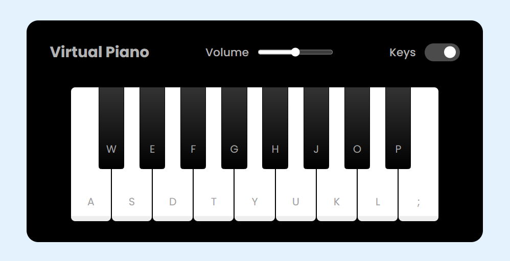

# Piano Simulator

Project developed at the Game Development Bootcamp.
Virtual Piano Simulator. 
You can play either by clicking with the mouse or using the keyboard keys.

To play, [click here](https://maripirczak.github.io/piano-simulator/). 

   

## Technologies Used

 
  
  
